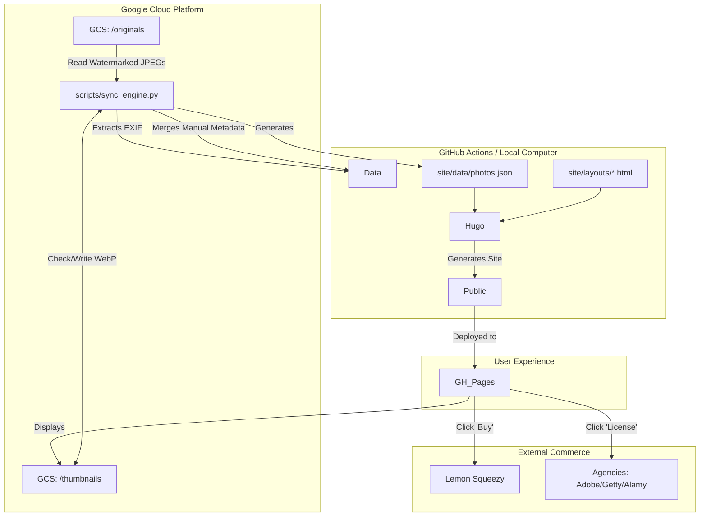

# **Project File Schema & Architecture**

## **1. Repository Structure (Local/GitHub)**

```text
.  
├── .github/  
│   └── workflows/  
│       └── deploy.yml          # CI/CD: Installs Python, runs Sync Engine, builds Hugo  
├── scripts/  
│   └── sync_engine.py          # Updated: Merges EXIF with Commerce/Licensing metadata  
├── site/  
│   ├── content/                # Generated dynamically  
│   │   └── gallery/  
│   │       └── [id].md         # Gallery stubs  
│   ├── data/  
│   │   ├── photos.json         # Master manifest (Public URLs + Commerce IDs)  
│   │   └── admin_photos.json   # Admin manifest (Signed URLs)  
│   ├── layouts/  
│   │   ├── _default/  
│   │   │   └── single.html     # Updated: Includes 'Smart Buttons' for purchasing  
│   │   └── index.html          # Landing page  
│   └── hugo.toml               # Config  
└── README.md
```

## **2. Google Cloud Storage (Bucket Schema)**

**Note:** The /originals/ folder now hosts **Watermarked JPEGs** for public display. Raw/Clean files for sale are hosted on the commerce platform (e.g., Lemon Squeezy) or a separate private bucket.

```text
gs://[your-bucket-name]/  
├── originals/                  # Publicly accessible (Watermarked)  
│   ├── japan-2024/  
│   │   ├── DSC0101_WM.jpg      # Watermarked display copy  
│   │   └── config.json         # Metadata: Titles, Stories, Product IDs, License URLs  
│   └── street-photography/  
│       └── IMG_99_WM.jpg  
│  
└── thumbnails/                 # Auto-generated by Sync Engine  
    ├── japan-2024/  
    │   └── DSC0101_WM.webp  
    └── street-photography/  
        └── IMG_99_WM.webp
```

## **3. Data Flow & Commerce Diagram (Mermaid)**


